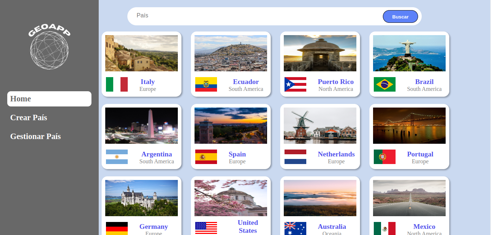
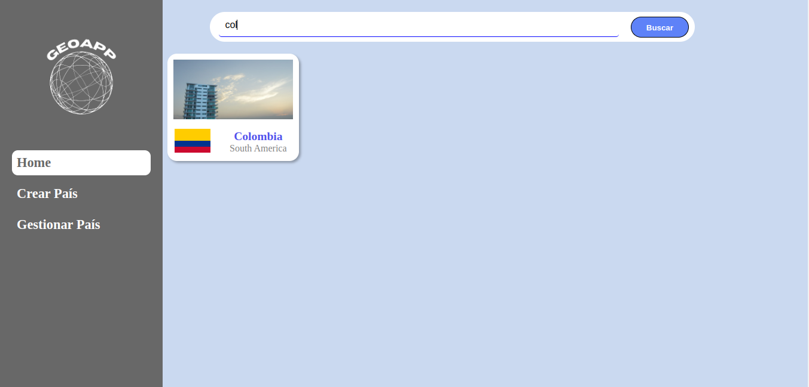
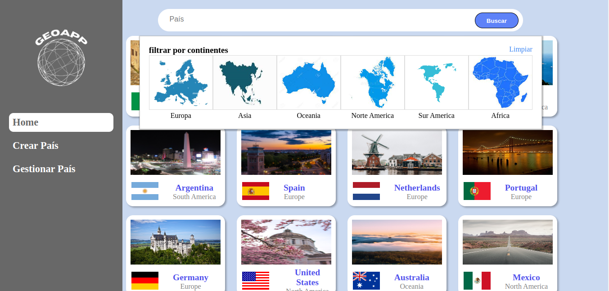
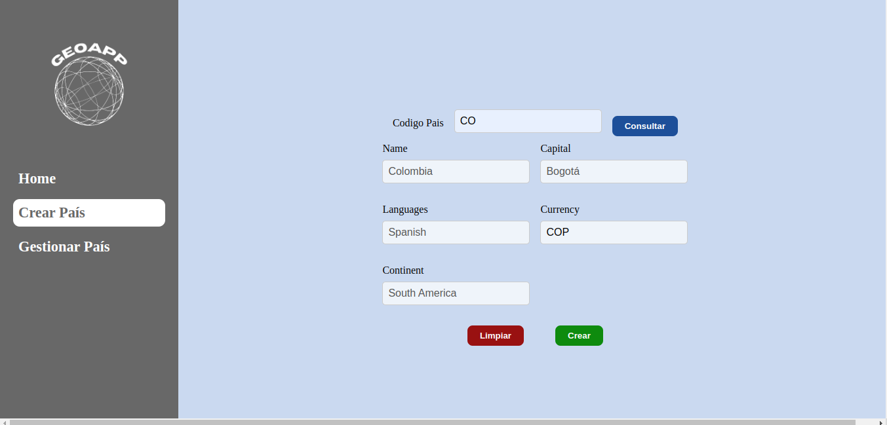
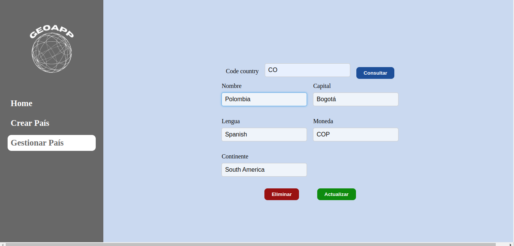

# GeoAPP: Your world in one click!!

**GeoAPP** is a web application designed to offer you an unparalleled experience. This tool allows you to systematically and easily organize your upcoming destinations, providing you with a personalized agenda of the countries you wish to visit. With **GeoAPP**, you have the ability to create and customize all this information according to your individual preferences.

## How It Works

**GeoAPP** functionality focuses on providing you with an intuitive and efficient method to create, edit, delete and view your preferred countries. You will no longer have to worry about losing sight of desired destinations or missing important details. With this app, you can create a detailed agenda that fits your specific interests and needs on future trips. **GeoAPP** helps you by providing you with all the necessary information about your next destination.

## Key Features

## Display
- You can visualize all your countries in a graphical and intuitive way on our `Home` window.



## Filter

**We want you to have the best experience, that's why you have two simple and easy-to-use tools to better visualize your countries.**

- You can use our search bar to quickly find that destination you want to know so much. This bar has quick filtering, as you type, your created countries will appear



- The second way is filtering by continent, by pressing the `Buscar` button found in the search bar you can access all the continents and filter your countries as you prefer (if you want to stop filtering, press the `Limpiar` button)



## Create 

- Want to create a country? You can do so in our `Create Country` window. Just enter the country code you want to create and press the `Consultar` button. All the information about this country will appear on your screen, just press the `Crear` button so that your next destination is scheduled.



## Modify

- Do you want to change the information of a country? Of course, in the `Gestionar Pais` window you only have to enter the code of your country created previously, press the `Consultar` button, modify any data and press the `Actualizar` button. If you want to delete said country, just enter the code, press the `Consultar` button and then the `Eliminar` button. This way you can interact with each country you want.




That's how simple it is to use **GeoAPP**.

## Installation

- First clone this repository
- In the terminal of the `server` folder and in the `client` folder, run the following command to install server dependencies:
```bash
npm i
```
## Database
For this project, we will use a non-SQL (non-relational) database, with the MongoDB database engine. Here, we will store all the information about the countries that you will be able to create in the future.

For each country, you will store:
- code
- name
- capital
- currency
- languages
- continent.


To access the database, use the following link in Mongo Compass:
```bash
mongodb+srv://<user>:<password>@cluster0.sxdtfez.mongodb.net/GeoApp

```
## Usage
- To run the server, use the following command within the `server` terminal:
```bash
nodemon index.js
```
- Then, to open GeoApp, use the command in the `client` terminal:
```bash
npm run dev
```
and select the link.


## Project Status
The Project is completely finished, We are developing future updates to improve your experience, would you like to access it from any device? o Would you also like to manage cities and other wonderful destinations? we are working for it.😃.
## Team Members
- Deivy Patiño
- Samuel Zapata
- Juan Diego Barrera
- Brallam Delgado

## Contact
For any issues or questions, contact us via email:

samuelzapatam1@gmail.com

Thank you for your support, contact us for any type of recommendation, enjoy  GeoAPP: Your world in one click!!


